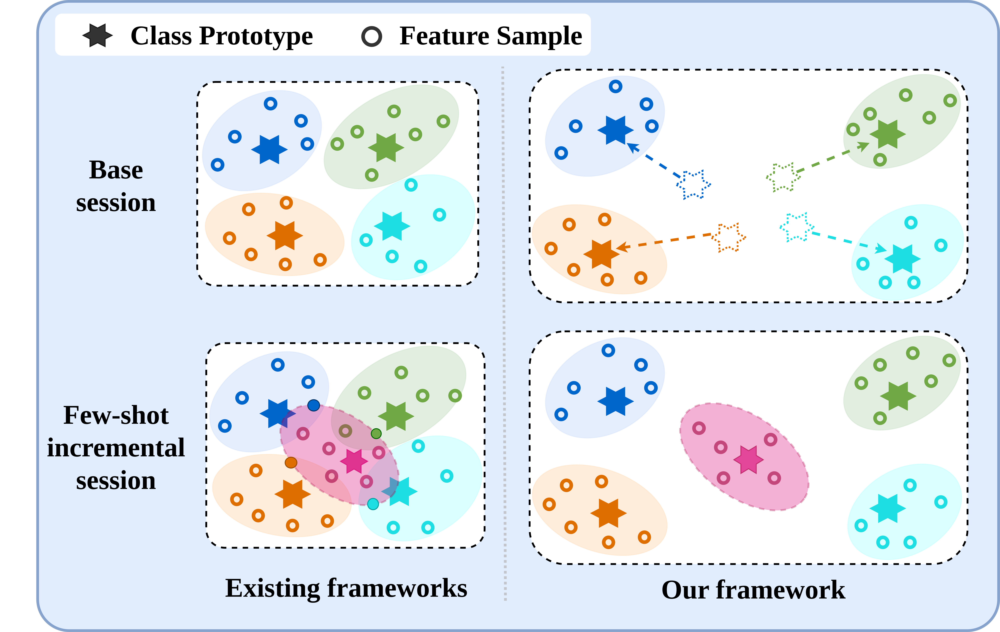

# FACL
This repository contains the official PyTorch implementation of our WACV 2025 paper: "Strategic Base Representation Learning via Feature Augmentations for Few-Shot Class Incremental Learning." [[paper]](http://arxiv.org/abs/2501.09361).


## Abstract
Few-shot class incremental learning implies the model to learn new classes while retaining knowledge of previously learned classes with a small number of training instances. Existing frameworks typically freeze the parameters of the previously learned classes during the incorporation of new classes. However, this approach often results in suboptimal class separation of previously learned classes,  leading to overlap between old and new classes. Consequently, the performance of old classes degrades on new classes. To address these challenges, we propose a novel feature augmentation driven contrastive learning framework designed to enhance the separation of previously learned classes to accommodate new classes. Our approach involves augmenting feature vectors and assigning proxy labels to these vectors. This strategy expands the feature space, ensuring seamless integration of new classes within the expanded space. Additionally, we employ a self-supervised contrastive loss to improve the separation between previous classes. We validate our framework through experiments on three FSCIL benchmark datasets: CIFAR100, miniImageNet, and CUB200. The results demonstrate that our Feature Augmentation driven Contrastive Learning framework significantly outperforms other approaches, achieving state-of-the-art performance.



## Architecture
The complete learning workflow of our model:


## Results
Performance Comparison on CIFAR100 Dataset **Average Acc.**: Average accuracy across all sessions. **ΔFI**: Improvement in performance compared to the fine-tune baseline in the last session. **PD**: Difference in performance between the first and last session.


| Method        | 0     | 1     | 2     | 3     | 4     | 5     | 6     | 7     | 8     | Average Acc. | ΔFI   |
|---------------|-------|-------|-------|-------|-------|-------|-------|-------|-------|--------------|-------|
| Finetune      | 64.10 | 39.61 | 15.37 |  9.80 |  6.67 |  3.80 |  3.70 |  3.14 |  2.65 | 16.54        | -     |
| iCaRL         | 64.10 | 53.28 | 41.69 | 34.13 | 27.93 | 25.06 | 20.41 | 15.48 | 13.73 | 32.87        | +11.08|
| EEIL          | 64.10 | 53.11 | 43.71 | 35.15 | 28.96 | 24.98 | 21.01 | 17.26 | 15.85 | 33.79        | +13.20|
| Rebalancing   | 64.10 | 53.05 | 43.96 | 36.97 | 31.61 | 26.73 | 21.23 | 16.78 | 13.54 | 34.22        | +10.89|
| TOPIC         | 64.10 | 55.88 | 47.07 | 45.16 | 40.11 | 36.38 | 33.96 | 31.55 | 29.37 | 42.62        | +26.72|
| SPPR          | 63.97 | 65.86 | 61.31 | 57.60 | 53.39 | 50.93 | 48.27 | 45.36 | 43.32 | 54.45        | +40.67|
| F2M           | 64.71 | 62.05 | 59.01 | 55.58 | 52.55 | 49.92 | 48.08 | 46.28 | 44.67 | 53.65        | +42.02|
| CEC           | 73.07 | 68.88 | 65.26 | 61.19 | 58.09 | 55.57 | 53.22 | 51.34 | 49.14 | 59.53        | +46.49|
| MetaFSCIL     | 74.50 | 70.10 | 66.84 | 62.77 | 59.48 | 56.52 | 54.36 | 52.56 | 49.97 | 60.79        | +47.32|
| FACT          | 74.60 | 72.09 | 67.56 | 63.52 | 61.38 | 58.36 | 56.28 | 54.24 | 52.64 | 62.24        | +49.49|
| TEEN          | 74.92 | 72.65 | 68.74 | 65.01 | 62.01 | 59.29 | 57.90 | 54.76 | 52.64 | 63.21        | +49.99|
| LIMIT         | 73.81 | 72.09 | 67.87 | 63.89 | 60.77 | 57.77 | 55.67 | 53.52 | 51.23 | 61.84        | +48.58|
| ILAR          | 77.50 | 73.20 | 70.80 | 66.70 | 64.00 | 62.10 | 60.50 | 58.70 | 56.40 | 65.54        | +53.75|
| ALICE         | 79.00 | 70.50 | 67.10 | 63.40 | 61.20 | 59.20 | 58.10 | 56.30 | 54.10 | 63.21        | +51.45|
| MICS          | 78.18 | 73.49 | 68.97 | 65.01 | 62.25 | 59.34 | 57.31 | 55.11 | 52.94 | 63.62        | +50.29|
| SAVC          | 78.77 | 73.31 | 69.31 | 64.93 | 61.70 | 59.25 | 57.13 | 55.19 | 53.12 | 63.63        | +50.47|
| SAGG          | 79.13 | 74.68 | 71.29 | 66.98 | 64.39 | 61.35 | 59.57 | 57.93 | 55.33 | 65.63        | +52.68|
| **FACL (Ours)**| 86.20| 81.55 | 76.95 | 72.50 | 68.75 | 65.68 | 63.16 | 60.62 | 58.20 | **70.40**    | +55.55|


For results on additional datasets, please refer to our [paper](http://arxiv.org/abs/2501.09361) for detailed values.

## Requirements

To install all the required packages listed in `requirements.txt`, use the following command:
```
pip install -r requirements.txt

```

## Datasets

We conducted our experiments using three benchmark datasets: **CIFAR-100**, **CUB-200**, and **miniImageNet**. The **CIFAR-100** dataset will be downloaded automatically by the code. For the **CUB-200** and **miniImageNet** datasets, you can manually download them using this [link](https://drive.google.com/drive/folders/11LxZCQj2FRCs0JTsf_dafvTHqFn2yGSN). After downloading, unzip the files and place all the data in the `dataset/` folder. For further information and settings for the datasets, you can follow the guidelines provided in [CEC](https://github.com/icoz69/CEC-CVPR2021).

```
tar -xvf miniimagenet.tar
tar -xvzf CUB_200_2011.tgz


```

 
## Training scripts

- CIFAR100

  ```
  python train.py -project facl -dataset cifar100 -lr_base 0.1 -lr_new 0.001 -epochs_base 600 -schedule Cosine -gpu 0 -moco_dim 32 -mlp -moco_t 0.07 -moco_m 0.995 -size_crops 32 18 -min_scale_crops 0.9 0.2 -max_scale_crops 1.0 0.7 -num_crops 2 4 -constrained_cropping -fantasy rotation2

  ```
  
- CUB200
    ```
    python train.py -project facl -dataset cub200 -gamma 0.1 -lr_base 0.002 -lr_new 0.000005 -epochs_base 120 -schedule Milestone -milestones 60 80 100 -gpu '0' -moco_dim 128 -mlp -moco_t 0.07 -moco_m 0.999 -size_crops 224 96 -min_scale_crops 0.2 0.05 -max_scale_crops 1.0 0.14 -num_crops 2 4 -constrained_cropping -fantasy rotation2 
    ```

- miniImageNet
    ```
    python train.py -project facl -dataset mini_imagenet -gamma 0.1 -lr_base 0.1 -lr_new 0.1 -epochs_base 120 -schedule Milestone -milestones 40 70 100 -gpu '0' -moco_dim 128 -mlp -moco_t 0.07 -moco_m 0.999 -size_crops 84 50 -min_scale_crops 0.2 0.05 -max_scale_crops 1.0 0.14 -num_crops 2 4 -constrained_cropping -fantasy rotation2 
    ```


## Acknowledgment
We express our gratitude to the following repositories for providing valuable components and functions that contributed to our work:

- [SAVC](https://github.com/zysong0113/SAVC)
- [CEC](https://github.com/icoz69/CEC-CVPR2021)

## Citation
Please consider giving us a citation and a star to our repository if any portion of our paper and code is useful for your research.

```
@misc{nema2025strategicbaserepresentationlearning,
      title={Strategic Base Representation Learning via Feature Augmentations for Few-Shot Class Incremental Learning}, 
      author={Parinita Nema and Vinod K Kurmi},
      year={2025},
      eprint={2501.09361},
      archivePrefix={arXiv},
      primaryClass={cs.CV},
      url={https://arxiv.org/abs/2501.09361}, 
}
```
